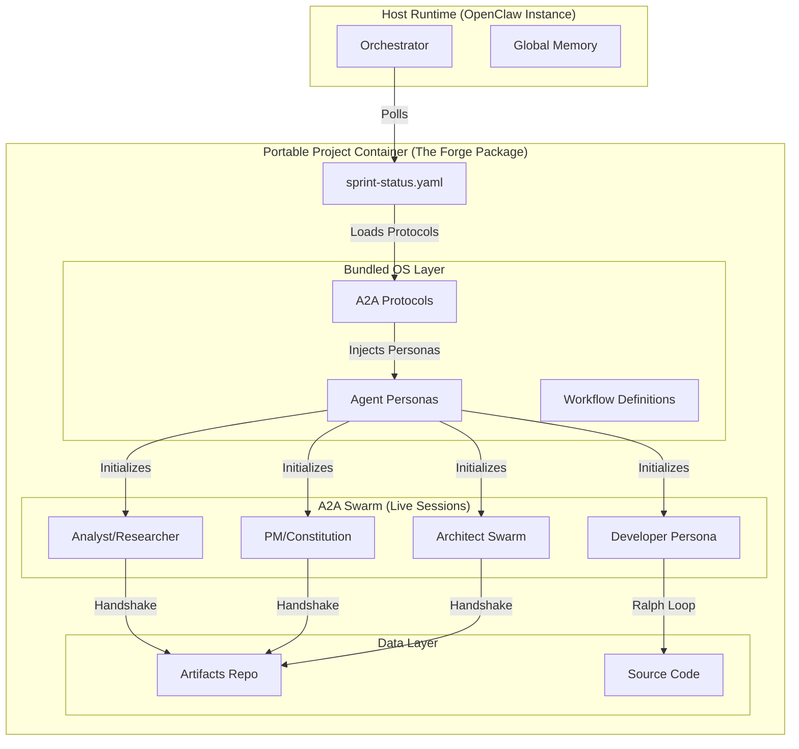
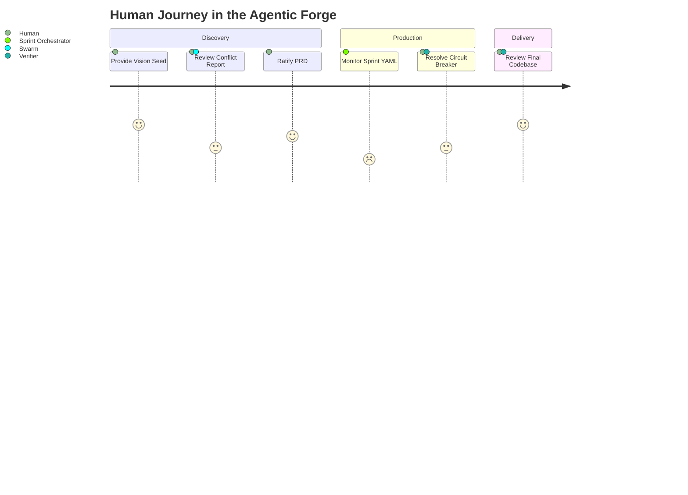
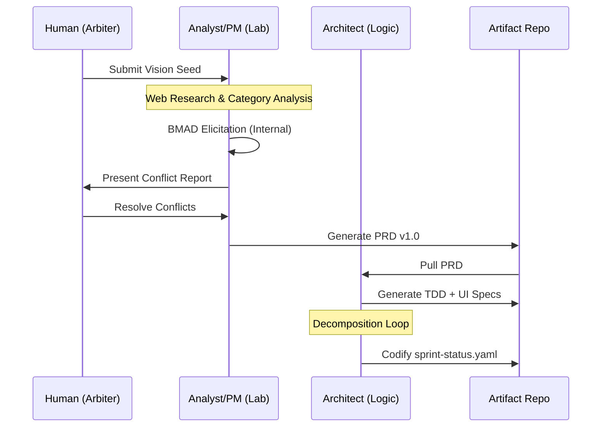

# PRD: The Agentic Forge (v2.0)
**Project Title:** Agentic Manufacturing Unit (AMU)  
**Status:** Strategic Blueprint  
**Date:** February 11, 2026

---

## 🏛️ Chain of Thought: Architectural Intent
The AMU is designed as a **Self-Eliciting Factory**. 

**The core logic shift:**
In traditional "Agentic Workflows," the human is the bottleneck—the one providing the context. In the **Forge v2.0**, the agents are the primary researchers. They use **BMAD-style Elicitation** to discover requirements by interviewing each other and the Internet, and only bringing "High-Entropy" conflicts to the human.

**Context Preservation:**
We utilize the **"Artifact Chain"** protocol. Every stage must result in a durable markdown/yaml file. These files act as the "Common Knowledge" (CK) of the factory, eliminating the need for long, drift-prone chat histories.

---

## 1. Executive Summary
The **Agentic Manufacturing Unit (AMU)** is a portable, end-to-end software production system. It bundles the **BMAD methodology** (Brainstorming/Elicitation) and the **Ant Farm Ralph Loop** (Isolated Execution) into a single **Project-Level Package**. By installing the "Factory OS" directly into each project's root directory, we ensure total **Interoperability and Portability**—allowing a project to be moved between OpenClaw instances while maintaining its full agentic manufacturing capabilities.

---

## 2. Portable Factory Architecture

### 2.1 The Bundled Project Structure
Every project is a self-contained unit containing the **Workforce Logic**, the **Persona Definitions**, and the **Product Data**. By decoupling personas from protocols, we ensure the Forge can adapt to different LLM standards (Claude, OpenAI) or IDE environments (Cursor, VSCode).

```text
[project-root]/
├── factory-os/             # The "Project OS"
│   ├── protocols/          # A2A Handshake logic (Platform-Agnostic)
│   ├── personas/           # Agent Souls (Prompt/Role definitions)
│   └── workflows/          # The Ralph Loop & Elicitation logic
├── artifacts/              # The "Truth Source" (PRD, TDD, UI Specs)
├── backlog/                # The "Task Feed" (Story files)
├── source/                 # The actual Codebase
└── sprint-status.yaml      # The central State Machine
```

### 2.2 System Architecture Diagram
This diagram illustrates the OpenClaw OS layer acting as the host for a self-contained, project-bundled Forge.



### 2.2 Use Case Diagram
Defining the relationship between the human "Strategic Arbiter" and the automated manufacturing processes.

```mermaid
useCaseDiagram
    actor "Strategic Arbiter (Human)" as Human
    package "Agentic Forge" {
        usecase "Provide Vision Seed" as UC1
        usecase "Arbitrate Context Conflicts" as UC2
        usecase "Ratify PRD/TDD" as UC3
        usecase "Resolve Blocked Stories" as UC4
        usecase "Autonomous Research" as UC5
        usecase "Self-Verify Code" as UC6
    }

    Human --> UC1
    Human --> UC2
    Human --> UC3
    Human --> UC4
    UC5 ..> UC2 : <<triggers>>
    UC6 ..> UC4 : <<triggers failure>>
```

### 2.3 User Journey: The Strategic Arbiter
Mapping the reduced cognitive load for the human user.



### 2.4 User Flow: From Vision to Story


---

## 3. Human-in-the-Loop (HITL) Protocol
Human intervention is restricted to **Strategic Arbitration**.

### When to Invoke Human Input:
1.  **Conflict Resolution:** When the Architect and PM agents hit a deadlock (e.g., "Feature A is desirable but technically unfeasible at scale").
2.  **Ratification Gates:** Final approval of the PRD v1.0 and the TDD (Technical Design Document) before coding begins.
3.  **Circuit Breaker Escalation:** When a story fails verification 3 times, it is tagged `🙋 @Human_Review` on the Kanban board.
4.  **Directional Steering:** Periodic check-ins to pivot the "Vision Seed" if market research suggests a new gap.

**HITL Mechanism:** Human tasks are created as P0 tickets on the **Claw Control** board. Agents pause that specific ticket but **continue working on other non-dependent stories** in parallel.

---

## 4. Stage 1: Autonomous Brainstorming (The Discovery Lab)

### The Workforce (No-Code Swarm)
*   **Analyst:** Internet-enabled researcher. Performs competitive analysis and macro-trend mapping.
*   **PM:** Enforces the "Product Constitution" and business value.
*   **Solutions Architect:** Defines the high-level logic flow.
*   **Functional Architect:** Maps user journeys and business rules.
*   **Cloud/Testing Architect:** Defines the infrastructure and quality baseline.
*   **UI Designer:** Crafts layouts using **Pencil UI** (generating `.epz` or detailed spec exports).
*   **UX Expert:** Conducts "Persona Journeys" to stress-test the empathy map.

---

## 5. Stage 2: Artifact Codification (The Blueprint)

### The Workflow Example: "Feature → Story"
- **Step 1:** The Architect Swarm reads the PRD and writes the **TDD.md** (database schemas, API contracts, infrastructure stack).
- **Step 2:** The **Scrum Master Agent** reads the TDD and initializes the **`sprint-status.yaml`**.
- **Step 3:** The SM generates individual **Story Files** in `backlog/stories/STORY-XXX.md`.

### Sprint Status Management (BMAD Inspired)
The `sprint-status.yaml` acts as the **Global State Machine**. It is the heartbeat of the factory, allowing agents to know exactly where they are in the workflow without needing session context.

---

## 6. Stage 3: Implementation & Verification (The Factory)

### The Developer's Context Package
The Developer Agent receives a complete "Truth Bundle" to prevent drift:
1.  **The Task:** The specific `STORY-XXX.md` file.
2.  **The Logic:** The `TDD.md` (How it *must* be built).
3.  **The Vision:** The `PRD.md` (Why we are building it).
4.  **The Environment:** `STANDARDS.md` (Coding style, linting rules, library versions).
5.  **The Codebase:** Read-access to existing files to ensure pattern matching.

### The Ralph Loop (Ant Farm Implementation)
1.  **Isolation:** A **fresh OpenClaw session** is spawned for the story.
2.  **Execution:** Developer writes the code and unit tests.
3.  **Verification:** A **Verifier Agent** in a *separate* session attempts to run the code and tests.
4.  **The Circuit Breaker:**
    - If `FAIL`: `failure_count` incremented. Developer retries.
    - If `failure_count == 3`: The story is marked `status: blocked`. 
    - **RESILIENCE:** The Orchestrator **immediately moves to the next `ready-for-dev` story**. The factory does not stop.

---

## 7. Project Outcomes (The Yield)
At the end of a project run, the Forge produces:
1.  **A Hardened Repository:** All code is verified and mapped 1:1 to artifacts.
2.  **Architectural Integrity:** No code exists that wasn't first defined in the TDD.
3.  **Documentation as a Byproduct:** PRDs, TDDs, and Sprint Reports are auto-generated and always up-to-date.
4.  **Zero-Drift History:** Because sessions are isolated, the final story is as high-quality as the first.

---
**Next Step for User:**
Review this V2.1 Blueprint with integrated diagrams. If the visualization matches your intent, say **"Proceed."**
