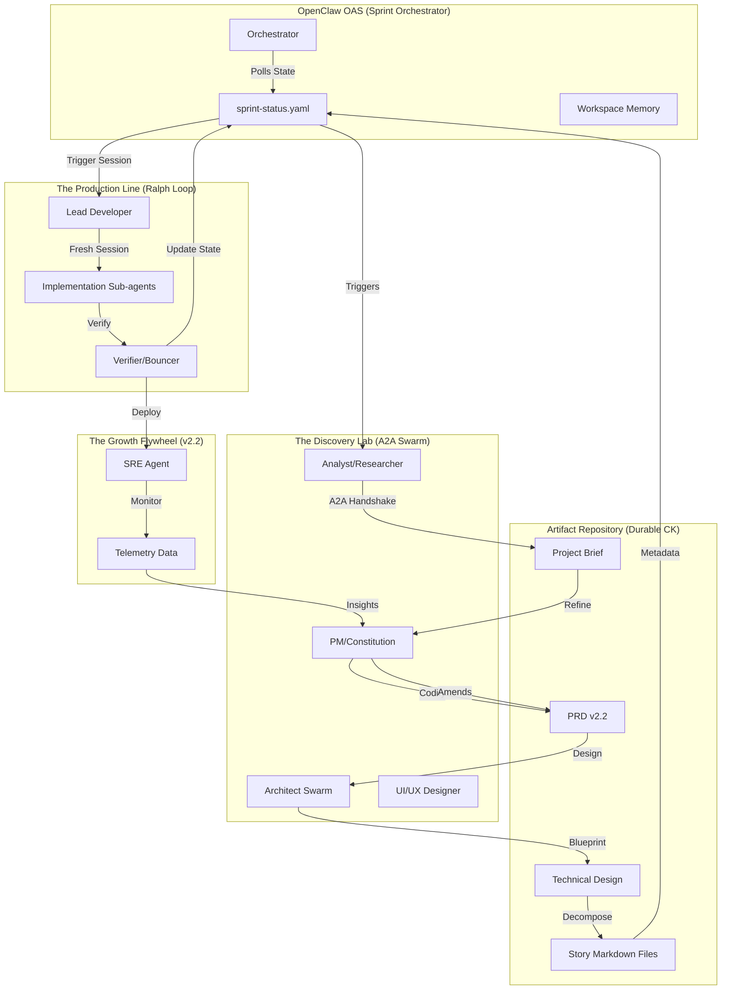
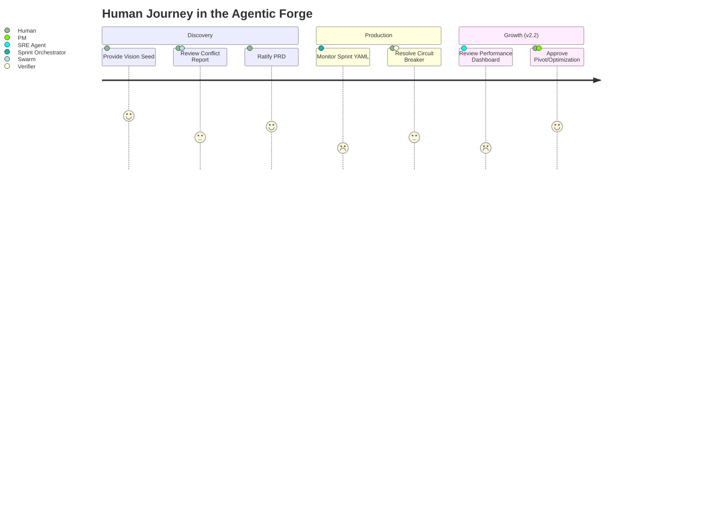
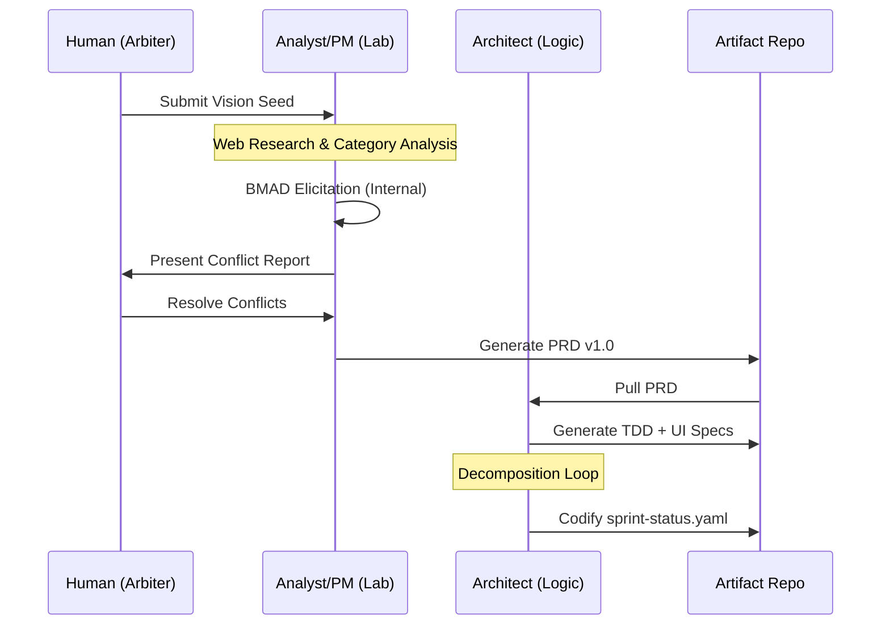

# PRD: The Agentic Forge (v2.2)
**Project Title:** Agentic Manufacturing Unit (AMU)  
**Status:** Strategic Blueprint (Refining for Growth)  
**Date:** February 11, 2026

---

## 🏛️ Chain of Thought: Architectural Intent
The AMU is designed as a **Self-Eliciting Factory**. 

**The core logic shift:**
In traditional "Agentic Workflows," the human is the bottleneck—the one providing the context. In the **Forge v2.2**, the agents are the primary researchers. They use **BMAD-style Elicitation** to discover requirements by interviewing each other and the Internet, and only bringing "High-Entropy" conflicts to the human.

**Context Preservation (The Artifact Chain):**
We utilize the **"Artifact Chain"** protocol. Every stage results in a durable markdown/yaml file. These files act as the "Common Knowledge" (CK) of the factory, eliminating the need for long, drift-prone chat histories. **V2.2 introduces the "Constitutional Flywheel," ensuring telemetry and feedback loop back to the PRD.**

---

## 1. Executive Summary
The **Agentic Manufacturing Unit (AMU)** is an end-to-end software production system built on OpenClaw. It integrates the **BMAD methodology** for context-rich planning and the **Ant Farm Ralph Loop** for verified, session-isolated execution. The unit minimizes human taxation by automating research, elicitation, and design, while maintaining a resilient, agile assembly line tracked via a file-based **Sprint Orchestrator**.

---

## 2. Visualizing the Factory (Diagrams)

### 2.1 System Architecture Diagram
This diagram illustrates the OpenClaw OS layer acting as the orchestrator for specialized A2A agents and the durable Artifact Repository.



### 2.2 Use Case Diagram
Defining the relationship between the human "Strategic Arbiter" and the automated manufacturing processes.

```mermaid
useCaseDiagram
    actor "Strategic Arbiter (Human)" as Human
    package "Agentic Forge" {
        usecase "Provide Vision Seed" as UC1
        usecase "Arbitrate Context Conflicts" as UC2
        usecase "Ratify PRD/TDD" as UC3
        usecase "Resolve Blocked Stories" as UC4
        usecase "Autonomous Research" as UC5
        usecase "Self-Verify Code" as UC6
        usecase "Review Telemetry Insights (v2.2)" as UC7
    }

    Human --> UC1
    Human --> UC2
    Human --> UC3
    Human --> UC4
    Human --> UC7
    UC5 ..> UC2 : <<triggers>>
    UC6 ..> UC4 : <<triggers failure>>
    UC7 ..> UC3 : <<triggers revision>>
```

### 2.3 User Journey: The Strategic Arbiter
Mapping the reduced cognitive load for the human user.



### 2.4 User Flow: From Vision to Story


---

## 3. Human-in-the-Loop (HITL) Protocol
Human intervention is restricted to **Strategic Arbitration**.

### When to Invoke Human Input:
1.  **Conflict Resolution:** When the Architect and PM agents hit a deadlock.
2.  **Ratification Gates:** Final approval of the PRD v2.2 and the TDD before coding begins.
3.  **Circuit Breaker Escalation:** When a story fails verification 3 times.
4.  **Growth Strategy (v2.2):** Reviewing suggested pivots based on live telemetry.

---

## 4. Stage 1: Autonomous Brainstorming (The Discovery Lab)
(Implementation identical to v2.1)

---

## 5. Stage 2: Artifact Codification (The Blueprint)
(Implementation identical to v2.1)

---

## 6. Stage 3: Implementation & Verification (The Factory)
(Implementation identical to v2.1)

---

## 7. Stage 4: Operational Governance & Telemetry (The Flywheel) [v2.2 NEW]

### The SRE Agent (The Guardian)
*   **Role:** Continuous health monitoring and automated recovery.
*   **Input:** Live deployment metrics and error logs.
*   **Output:** Automated incident reports and **"Insight Tickets"** for the PM.

### Closing the Loop
In v2.2, the factory doesn't stop at deployment. The **Constitutional Flywheel** ensures that:
1.  **Telemetry to Insight:** Live data is analyzed by the SRE and PM agents.
2.  **Insight to Revision:** If a feature isn't meeting the "Success Metrics" defined in the PRD, the PM agent generates a **Revision Draft**.
3.  **Revision to Sprint:** The Architect decomposes the revision into new stories, and the cycle repeats.

---

## 8. Project Outcomes (The Yield)
At the end of a project run, the Forge produces:
1.  **A Hardened Repository:** All code is verified and mapped 1:1 to artifacts.
2.  **Architectural Integrity:** No code exists that wasn't first defined in the TDD.
3.  **Zero-Drift History:** Because sessions are isolated, the final story is as high-quality as the first.
4.  **Operational Intelligence (v2.2):** A product that learns and adapts based on real-world usage.

---
**Next Step for User:**
Review this **V2.2 Blueprint** with the new **Constitutional Flywheel**. If the growth phase matches your intent, say **"Proceed."**
