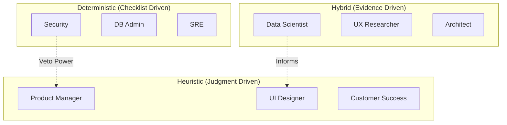

# Strategic Directive: The Decision Complexity Matrix
**Aligning Cognitive Logic with Organizational Impact**
**Classification:** Confidential Executive Briefing
**Author:** Subu (Principal Strategy Architect)

---

## 1. Executive Summary
The most common friction point in engineering culture is **Logic Misalignment**. The **Decision Complexity Matrix** (DCM) separates roles that solve for "Correctness" (Binary/Deterministic) from those that solve for "Context" (Probabilistic/Heuristic). By managing these two groups with different KPIs and communication styles, we eliminate the "Bureaucratic Drag" that kills fast-moving teams.

---

## 2. Chain of Thought (The Architect’s Logic)
*   **Problem:** We try to manage a Designer (Heuristic) and a Security Engineer (Deterministic) with the same Scrum board. 
*   **Hypothesis:** Deterministic roles thrive on "Checklists and SLAs." Heuristic roles thrive on "Outcomes and Iteration."
*   **The "Context Shift" Law:** A Deterministic decision is made via "Logic"; a Heuristic decision is made via "Judgment."
*   **Solution:** Create a "Bimodal Management" system that respects the nature of the problem being solved.

---

## 3. The Complexity Matrix (Mermaid Diagram)

---

## 4. Why This Works: Removing the "Vibe" from Logic
*   **Zero-Defect Culture:** For Deterministic roles (Security/DBA), we encourage a "Zero-Vibe" culture. We want pure math and checklists. This ensures safety.
*   **Creative Freedom:** For Heuristic roles (Product/Design), we remove the "Right vs. Wrong" pressure and replace it with "Tested vs. Untested." This encourages bold innovation.
*   **Objective Arbitration:** The Hybrid roles (Data Science/Research) act as the "Court." When Heuristic roles disagree, they use Deterministic data to find the answer.

---

## 5. Where It Fails: The "Veto" War
*   **The Deterministic Dictatorship:** If Security (Deterministic) has too much power, they will ban all new features because "Nothing is 100% safe."
*   **The Heuristic Chaos:** If Product (Heuristic) has too much power, they will ignore the "Laws of Physics" of the database, leading to system crashes.
*   **Research Insight:** *Daniel Kahneman’s "Thinking, Fast and Slow"* (System 1 vs System 2). Organizations often use System 1 (Intuition/Heuristic) for System 2 (Logical/Deterministic) problems, leading to "Groupthink" and technical debt.

---

## 6. Real-World Case Study: NASA vs. SpaceX
*   **NASA (Legacy):** Hyper-Deterministic. Every decision requires a 100-page manual. Result: Extreme safety, but extreme cost and slow speed.
*   **SpaceX:** A perfect Hybrid. They use Heuristic "Guess and Test" for prototyping (letting rockets blow up) but shift to rigid Deterministic logic for the final flight software. They know *when* to use which brain.

---

## 7. Strategic Recommendations
1.  **Differentiated Performance Reviews:** 
    *   **Deterministic:** Measured by "Reliability" and "Policy Compliance." 
    *   **Heuristic:** Measured by "User Conversion" and "Innovation Velocity."
2.  **The "Safety Veto":** Allow Deterministic roles (Security/SRE) a "Red Button" to stop a launch, but force them to provide a "Logical Path to Green" within 24 hours.
3.  **Bimodal Communication:** Use Slack for Heuristic "Vibe" discussions. Use Jira/Docs for Deterministic "Logic" requirements. Never mix them.

---
*Generated for ANT-Coding Project | Strategic Excellence Series*
