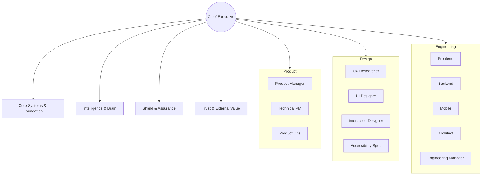

# Strategic Directive: The Functional Domain Framework
**Optimizing Departmental Silos for High-Velocity Engineering**
**Classification:** Confidential Executive Briefing
**Author:** Subu (Principal Strategy Architect)

---

## 1. Executive Summary
In the era of hyper-specialization, the "Full-Stack" generalist is an endangered species in scalable organizations. The **Functional Domain Framework** (FDF) is a structural methodology that clusters the 27 identified roles into discrete "Centers of Excellence." This directive outlines how to orchestrate these domains to ensure that functional expertise is concentrated while maintaining a unified product direction.

---

## 2. Chain of Thought (The Architect’s Logic)
*   **Problem:** As teams scale, information entropy increases. If everyone tries to do everything, "decision paralysis" sets in.
*   **Hypothesis:** Productivity is a function of "Cognitive Load Management." By limiting a team's scope to a specific domain, we increase deep-work capacity.
*   **Validation:** Conway’s Law states that organizations design systems which mirror their communication structures. Therefore, a messy org chart guarantees a messy codebase.
*   **Solution:** We must build the org chart as a reflection of the system architecture we want (e.g., Microservices = Functional Domains).

---

## 3. The Functional Taxonomy (Mermaid Diagram)

---

## 4. Why This Works: Concentration of Mastery
*   **The Spotify Model Analogy:** This is essentially the "Chapter" system. It allows a Backend Engineer in Team A to share knowledge and standards with a Backend Engineer in Team B.
*   **Standardization:** Functional domains create "Golden Paths." The Security domain sets the firewall policy once, and the entire organization inherits it.
*   **Career Pathing:** It is much easier to define what a "Senior" vs "Staff" engineer looks like within a functional domain than in a generic "Developer" bucket.

---

## 5. Where It Fails: The "Silo" Catastrophe
*   **The Handover Gap:** When a feature moves from "Design Domain" to "Engineering Domain," context is often lost.
*   **Tribalism:** Domains may start competing for budget or prestige ("Design thinks they are more important than Engineering").
*   **Research Insight:** According to *Harvard Business Review (HBR)*, functional silos are the #1 cause of product launch delays. The "Over-the-Wall" mentality leads to massive rework.

---

## 6. Real-World Case Study: Apple vs. Microsoft (The 90s)
*   **Microsoft (The 90s):** Highly functional/product-siloed. Teams for Word and Excel competed so fiercely they wouldn't share code, leading to bloated, inconsistent software.
*   **Apple (Modern):** Functions are centralized (Design reports to a Design VP, not a product head). This ensures that a button in iOS feels exactly like a button on a Mac—extreme functional consistency.

---

## 7. Strategic Recommendations
1.  **Implement the "T-Shaped" Mandate:** Every hire must be a world-class specialist in their domain (The vertical bar of the T) but have enough knowledge of adjacent domains to collaborate (The horizontal bar).
2.  **The 20% Rotation Rule:** High-potential employees should rotate to an adjacent domain (e.g., Backend to DevOps) for one month every two years to break silos.
3.  **Unified Tooling:** Ensure the "Shield" domain (Security) uses the same task-management system as "Application Delivery" to avoid "Information Dark Spots."

---
*Generated for ANT-Coding Project | Strategic Excellence Series*
