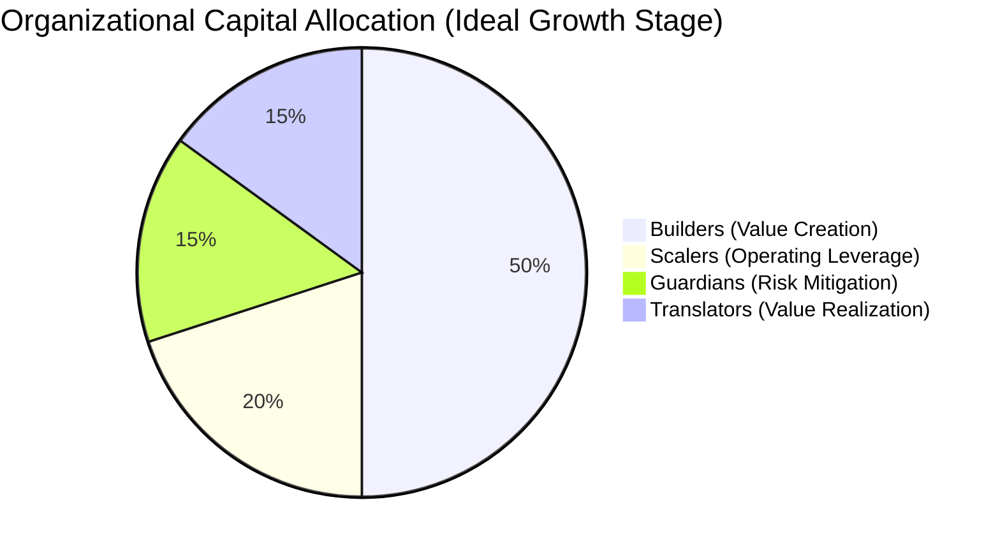

# Strategic Directive: Outcome and Impact Strategy
**Capital Allocation and the Taxonomy of Value Creation**
**Classification:** Confidential Executive Briefing
**Author:** Subu (Principal Strategy Architect)

---

## 1. Executive Summary
Organizations frequently misidentify "Headcount" as an expense rather than an "Asset Class." The **Outcome and Impact Strategy** (OIS) re-categorizes the 27 roles based on their primary economic contribution. This framework allows CFOs and CTOs to view the organization as a balanced portfolio of Innovation (Builders), Efficiency (Scalers), Security (Guardians), and Revenue Adoption (Translators).

---

## 2. Chain of Thought (The Architect’s Logic)
*   **Problem:** Standard org charts treat a Frontend Dev and a DevOps Engineer the same (as "Engineers"). But their economic impact is fundamentally different.
*   **Hypothesis:** If we spend too much on "Builders" without "Scalers," our unit cost of production stays linear, and we never achieve software-level margins.
*   **The "Operating Leverage" Law:** Software value is generated by Builders, but *Profit* is generated by Scalers.
*   **Solution:** Budget the organization based on "Value Categories" rather than "Job Titles."

---

## 3. The Impact Portfolio (Mermaid Diagram)

### The Allocation Breakdown:
1.  **Builders (The Assets):** Frontend, Backend, Mobile, Data Scientist. (Economic Impact: Creating the Intellectual Property).
2.  **Scalers (The Leverage):** SRE, DevOps, Software Architect, Testing Architect. (Economic Impact: Reducing the cost per user as you grow).
3.  **Guardians (The Insurance):** Security Engineer, QA, DBA, a11y. (Economic Impact: Preventing catastrophic wealth destruction).
4.  **Translators (The Velocity):** Tech Writer, Tech Support, Customer Success. (Economic Impact: Reducing time-to-value for the customer).

---

## 4. Why This Works: Sustainable Unit Economics
*   **Preventing "Manual Scaling":** By forcing a budget for **Scalers**, we ensure that we don't just "hire more people" when the system gets slow. We hire "better automation."
*   **Protecting the Moat:** By recognizing **Guardians** as a discrete group, we ensure that "Speed" (Builders) doesn't accidentally destroy "Integrity" (Security/QA).
*   **Market Realization:** A product that is 10x better but 10x harder to use (No Translators) is worth $0.

---

## 5. Where It Fails: The "Scale Lag"
*   **Premature Scaling:** Spending too much on **Scalers** before you have a product people want (Product-Market Fit).
*   **The "Guardian" Bottleneck:** If Guardians have too much power and not enough automation, they become a "Department of NO," killing innovation.
*   **Research Insight:** *Clayton Christensen’s "Innovator's Dilemma"* suggests that mature companies over-invest in **Guardians/Scalers** and lose the ability to hire **Builders** who can disrupt them.

---

## 6. Real-World Case Study: WhatsApp vs. Legacy Telcos
*   **WhatsApp (2014):** They had only **50 engineers for 450 million users**. 
*   **The Secret:** They were 90% **Scalers** (Erlang experts focused on concurrency). They didn't build thousands of features; they built a "Scaling Engine" that required almost zero manual intervention.
*   **Legacy Telcos:** They were 90% **Translators** and **Guardians** (Support/Compliance). They couldn't move fast enough to compete with the pure technical leverage of a Scaler-heavy team.

---

## 7. Strategic Recommendations
1.  **The "Leverage" Audit:** Every quarter, calculate your **User-to-Scaler Ratio**. If your user base grew 100% but your SRE/DevOps team also had to grow 100%, you are failing to scale.
2.  **Build vs. Buy for Guardians:** For "Guardian" roles (Security/Compliance), use third-party platforms (like Vanta or Wiz) to automate 80% of the work so your human Guardians can focus on high-level strategy.
3.  **Incentive Alignment:** Reward Builders for "Feature Velocity," but reward Scalers for "Reduction in Operational Toil."

---
*Generated for ANT-Coding Project | Strategic Excellence Series*
