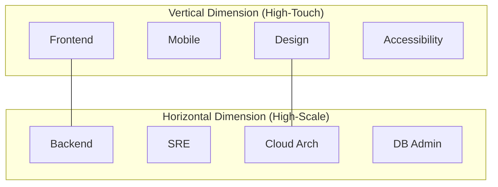

# Strategic Directive: Scaling Dimensions Blueprint
**Vertical Polish vs. Horizontal Resilience**
**Classification:** Confidential Executive Briefing
**Author:** Subu (Principal Strategy Architect)

---

## 1. Executive Summary
Scaling is not a single direction; it is a **Coordinate System**. The **Scaling Dimensions Blueprint** (SDB) distinguishes between **Vertical Scaling** (Feature Depth, UX Polish, Localization) and **Horizontal Scaling** (User Capacity, Regional Redundancy, Data Throughput). Companies that over-invest in one while neglecting the other face "Catastrophic Success"—where virality leads to permanent system failure.

---

## 2. Chain of Thought (The Architect’s Logic)
*   **Problem:** Marketing wants more features (Vertical); Engineering wants more stability (Horizontal). They are in constant conflict.
*   **Hypothesis:** Growth is a "Load-Bearing" problem. You cannot build a 50-story skyscraper (Vertical) on a foundation designed for a house (Horizontal).
*   **The "Foundation First" Law:** Horizontal capacity must always lead Vertical features by a factor of 2x.
*   **Solution:** Treat "Resilience" as a feature, not a byproduct.

---

## 3. The Scaling Coordinate System (Mermaid Diagram)

---

## 4. Why This Works: Avoiding "Brand Bankruptcy"
*   **Quality at Scale:** By ensuring **Vertical** roles (Designers/Mobile Devs) work in tandem with **Horizontal** roles (SREs), you ensure that a beautiful feature doesn't time out for 50% of users.
*   **Market Expansion:** Horizontal roles build the "Pipes" (Global region support) so that Vertical roles can launch the localized "Content" (Translating the app into 10 languages).
*   **Predictable Infrastructure:** You know exactly how much a new "Vertical" feature will cost in "Horizontal" cloud credits before you launch.

---

## 5. Where It Fails: The "Viral Crash"
*   **The MVP Trap:** Building a feature-rich "Vertical" MVP that works for 10 testers but is architected in a way that it cannot be "Horizontally" sharded. 
*   **The Boring Foundation:** If you only hire **Horizontal** scalers, you build a system that can handle 1 billion users but has zero features that those users actually want.
*   **Research Insight:** *The "Brooks' Law"* (The Mythical Man-Month). Adding more "Vertical" developers to a late project makes it later. But investing in "Horizontal" infrastructure (automated testing, CI/CD) actually speeds it up.

---

## 6. Real-World Case Study: Twitter (2007-2010)
*   **The Strategy:** Twitter focused entirely on **Vertical** growth (the core tweet feature). 
*   **The Result:** The "Fail Whale." Their **Horizontal** foundation was so weak that every time a major event happened (like the World Cup), the site crashed. They had to spend 2 years rewritten in Scala just to fix the Horizontal dimension.

---

## 7. Strategic Recommendations
1.  **Capacity Budgeting:** For every 3 "Vertical" features on the roadmap, the "Horizontal" team must be allocated 1 "Resilience Sprint" to harden the foundation.
2.  **Shared SLOs:** A "Vertical" Frontend dev should be measured by "UI Latency," which forces them to care about the "Horizontal" Backend's speed.
3.  **Global-First Architecture:** Hire your Cloud Architect (Horizontal) before your UI Designer (Vertical) when building for a global market. It is easier to change a button color than to change a data sharding strategy.

---
*Generated for ANT-Coding Project | Strategic Excellence Series*
