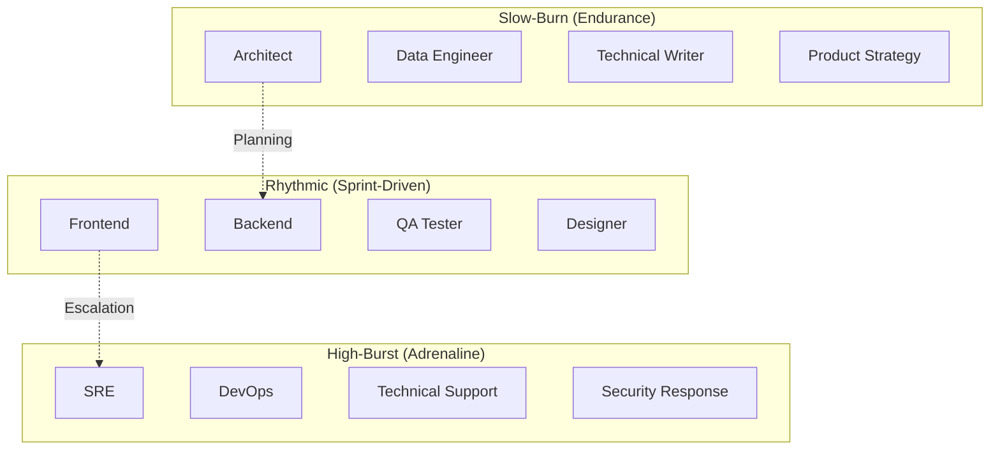

# Strategic Directive: Stress and Resiliency Profile
**Architecting the Human Operating System**
**Classification:** Confidential Executive Briefing
**Author:** Subu (Principal Strategy Architect)

---

## 1. Executive Summary
High-performing software teams are often decimated by a silent killer: **Profile-Mismatch Burnout**. The **Stress and Resiliency Profile** (SRP) categorizes roles based on the *cadence* and *nature* of the stress they endure. By aligning individuals' psychological temperaments with their role’s stress profile, we ensure long-term retention and peak performance under pressure.

---

## 2. Chain of Thought (The Architect’s Logic)
*   **Problem:** We treat all stress as "Bad." But some people love high-pressure bursts, while others love steady, deep work.
*   **Hypothesis:** Burnout occurs when a "Slow-Burner" is forced into an "On-Call" rotation, or an "Adrenaline Junkie" is forced to write documentation for 3 months.
*   **The "Human Infrastructure" Law:** The emotional cost of an incident is inversely proportional to the team's "Resiliency Alignment."
*   **Solution:** Design the team’s "On-Call" and "Sprint" cycles around these psychological archetypes.

---

## 3. The Stress Profiles (Mermaid Diagram)

---

## 4. Why This Works: Psychology-Role Alignment
*   **Operational Elite:** **High-Burst** roles are the "First Responders." By identifying them, we can provide them with "Ready-State" downtime. They aren't lazy; they are in a state of hyper-vigilance.
*   **Architectural Wisdom:** **Slow-Burn** roles are the "Planners." They prevent tomorrow's fires. By protecting them from daily Slack "pings," we allow them to build 5-year-resilient systems.
*   **Delivery Engines:** **Rhythmic** roles are the "Heartbeat." They thrive on the "Done" dopamine hit at the end of every 2-week sprint.

---

## 5. Where It Fails: The "Interruption Tax"
*   **The SRE Burnout:** Expecting a High-Burst SRE to also do Slow-Burn architectural planning in between server fires. 
*   **The Stagnant Designer:** Expecting a Rhythmic UI Designer to enjoy a 6-month Slow-Burn research project without shipping anything.
*   **Research Insight:** *Mihaly Csikszentmihalyi’s "Flow"* indicates that different profiles reach "Flow" at different speeds. Forcing a High-Burst role on a Slow-Burner effectively "Breaks their Brain," leading to 50% lower cognitive output for up to 3 days after an incident.

---

## 6. Real-World Case Study: NASA vs. Startup Culture
*   **NASA:** Highly **Slow-Burn**. They optimize for 20-year missions. Result: Massive resiliency, but they struggle with High-Burst market pivots.
*   **Hyper-Growth Startups:** Highly **High-Burst**. Everything is a fire. Result: Extreme speed, but massive turnover (employees leave after 12 months) and "Swiss Cheese" architecture full of holes.

---

## 7. Strategic Recommendations
1.  **Differentiated On-Call Compensation:** Pay High-Burst roles a premium for their "Standby Time," even if no tickets come in. You are paying for their **Readiness**.
2.  **The "Deep-Work Cave":** Create a policy where Slow-Burn roles (Architects/Data Eng) can take a "Digital Sabbatical" for 3 days every month to focus on long-term strategy.
3.  **Cross-Training (Empathy):** Once a year, make a Rhythmic developer shadow a High-Burst SRE for 24 hours. They will write better, more stable code once they see the "Adrenaline" cost of a bug.

---
*Generated for ANT-Coding Project | Strategic Excellence Series*
