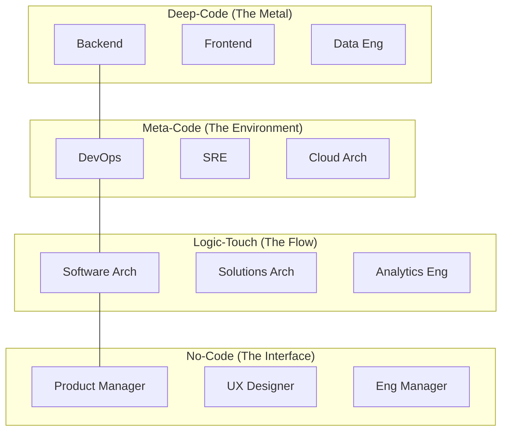

# Strategic Directive: The Technical Proximity Spectrum
**Cognitive Load Management from Terminal to Boardroom**
**Classification:** Confidential Executive Briefing
**Author:** Subu (Principal Strategy Architect)

---

## 1. Executive Summary
The most common cause of high-performer attrition is **Context-Switching Exhaustion**. The **Technical Proximity Spectrum** (TPS) is a framework for managing the psychological and environmental needs of the team based on their distance from the "Metal" (the executing code). By aligning meeting schedules, office environments, and KPIs to this proximity, we can maximize "Flow State" efficiency.

---

## 2. Chain of Thought (The Architect’s Logic)
*   **Problem:** We treat a Software Architect and a Backend Dev the same way in meetings. But their "Brain Cycles" are different.
*   **Hypothesis:** The closer you are to the code ("Metal"), the higher the cost of an interruption. 
*   **The "Maker's Schedule" Law:** A 15-minute interruption to a Deep-Coder costs 2 hours of productivity. A 15-minute interruption to a PM (No-Coder) costs almost nothing.
*   **Solution:** Build a "Shield" around the Deep-Coders and a "Conduit" around the No-Coders.

---

## 3. The Proximity Spectrum (Mermaid Diagram)

---

## 4. Why This Works: Cognitive Alignment
*   **Deep-Code Protection:** By identifying who is "Deep-Code," we can enforce "No-Meeting Zones." These roles are measured by **Deep Work Hours**.
*   **Meta-Code Agility:** These roles thrive on specialized "Environment" metrics (e.g., Build Times, Deployment Success).
*   **No-Code Orchestration:** These roles are the "External Sensors." They are measured by **Stakeholder Alignment** and **Market Clarity**.

---

## 5. Where It Fails: The "Translation Leak"
*   **Architectural Drifting:** If the "Logic-Touch" (Architects) get too far from the "Deep-Code" (Devs), they start designing systems that are impossible to build (The "Architecture Astronaut" problem).
*   **Infrastructure Blindness:** If "No-Coders" (PMs) don't understand the "Meta-Code" (Infra) constraints, they create roadmaps that the Cloud Architect cannot support.
*   **Research Insight:** *Paul Graham's "Maker's Schedule, Manager's Schedule"* is the foundational research here. Mixing these schedules creates "Organizational Friction" that slows down the entire company.

---

## 6. Real-World Case Study: Meta (Facebook)
*   **The Strategy:** Meta famously maintains a "Flat" engineering culture where even very high-level engineers are expected to be "Deep-Code" (submitting PRs).
*   **The Result:** This forces the Proximity Spectrum to stay tight. It prevents the "Ivory Tower" problem but places a massive cognitive load on senior leadership. They trade "Leadership Focus" for "Technical Grounding."

---

## 7. Strategic Recommendations
1.  **Differentiated Notification Policies:** "Deep-Code" roles should be allowed to stay offline (Slack/Email) for 4-hour blocks. "No-Code" roles should be responsive within 30 minutes.
2.  **The "Hands-on Architect":** Require every "Logic-Touch" architect to submit at least one meaningful PR (code change) every month to ensure they haven't lost touch with the "Metal."
3.  **Physical/Digital Zoning:** If in an office, Deep-Coders need "Quiet Zones" (Library-style). No-Coders need "Collaboration Pods" (Coffee-shop style).

---
*Generated for ANT-Coding Project | Strategic Excellence Series*
