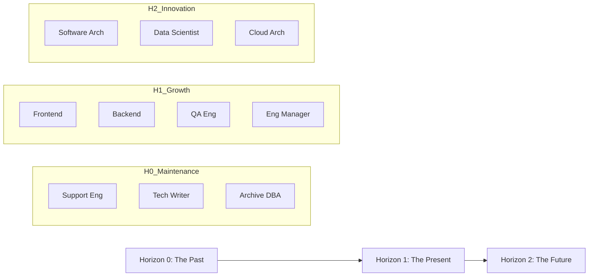

# Strategic Directive: Temporal Horizon Mapping
**The Archeology of Legacy and the Vision of the Future**
**Classification:** Confidential Executive Briefing
**Author:** Subu (Principal Strategy Architect)

---

## 1. Executive Summary
Companies do not die because they fail to innovate; they die because they cannot manage the **Conflict of Time**. The **Temporal Horizon Mapping** (THM) framework ensures that the organization maintains a balanced investment across three distinct time-scales: The Past (Maintenance), The Present (Growth), and The Future (Innovation).

---

## 2. Chain of Thought (The Architect’s Logic)
*   **Problem:** If we spend all our time fixing old bugs (The Past), we stop growing. If we spend all our time on new R&D (The Future), our current customers churn.
*   **Hypothesis:** Organizational health is a ratio. We must deliberately allocate talent based on "Horizon Priorities."
*   **The "Innovation Trap":** The more successful a product is, the more "The Past" (Maintenance) tries to consume "The Future" (R&D).
*   **Solution:** Create dedicated teams for each Horizon so they don't compete for the same hour of a developer's day.

---

## 3. The Three Horizons (Mermaid Diagram)

---

## 4. Why This Works: Protecting Innovation
*   **Isolation of Toil:** By giving "The Past" its own dedicated roles (Support, Tech Writers), you prevent "The Present" (Devs) from being overwhelmed by legacy tickets.
*   **Strategic R&D:** Roles like Data Scientists and Architects are "prophets." They need the freedom to fail, which is only possible if they are separated from the high-pressure "Weekly Sprint" of the Present.
*   **Long-term Moat:** You are constantly building the "Next Product" while the "Current Product" pays the bills.

---

## 5. Where It Fails: The "Disconnection" Debt
*   **The Ivory Tower (H2):** If the Future team builds things that are too "futuristic" and cannot be implemented by the Present team.
*   **The Legacy Pit (H0):** If the company stops hiring for "The Past," the technical debt grows so large that it eventually "Bankrupts" the Present.
*   **Research Insight:** *McKinsey’s Three Horizons Framework* originally proposed this. However, in the modern software era, these horizons have compressed. H2 is now only 6 months away, not 3 years.

---

## 6. Real-World Case Study: Google (20/20 Rule)
*   **The Strategy:** Google famously allowed "20% Time" for H2/H3 projects. 
*   **The Result:** This created Gmail and AdSense. But it also created "Project Fragmentation." Eventually, they had to hire more "H0/H1" people to clean up the mess and consolidate their offerings.

---

## 7. Strategic Recommendations
1.  **The 70/20/10 Budget:** Allocate 70% of resources to H1 (Core Growth), 20% to H2 (Strategic Innovation), and 10% to H0 (Legacy/Documentation).
2.  **The "Kill Switch":** Every 6 months, the H2 team must present a "Prototype" to the H1 team. If the H1 team says "This is impossible to implement," the project is killed or pivoted immediately.
3.  **Automate the Past:** The goal of H0 (Historians) is to **automate themselves out of a job**. Use AI for documentation and support so that more of that 10% budget can shift into H2.

---
*Generated for ANT-Coding Project | Strategic Excellence Series*
