# Strategic Directive: The Visibility and Interface Matrix
**Managing the Economic Friction of Technical Translation**
**Classification:** Confidential Executive Briefing
**Author:** Subu (Principal Strategy Architect)

---

## 1. Executive Summary
The most expensive commodity in a software company is not compute power—it is **Context**. The **Visibility and Interface Matrix** (VIM) is a strategic lens that categorizes roles based on their proximity to the end-user. By acknowledging that different roles require different "Languages," we can optimize the "Interface" between the market and the machine.

---

## 2. Chain of Thought (The Architect’s Logic)
*   **Problem:** Engineers think in "System Limits"; Customers think in "Business Outcomes." These two languages are incompatible.
*   **Hypothesis:** Organizational failure occurs at the "Interface Layer." If a PM (Front-of-House) promises a feature that violates a Database Constraint (Back-of-House), the company loses money.
*   **The "Context Decay" Law:** Every step data takes from a user to a developer results in a 20% loss of nuance. We must minimize steps or maximize the quality of the "Bridge."
*   **Solution:** Clearly define roles as either "Signal Catchers" (Front), "Signal Processors" (Bridge), or "Signal Implementers" (Back).

---

## 3. The Visibility Matrix (Mermaid Diagram)

```mermaid
graph LR
    User((The User/Market)) -- Market Signals --> FOH[Front-of-House]
    FOH -- User Stories/PRDs --> Bridge[The Translation Layer]
    Bridge -- Technical Specs --> BOH[Back-of-House]
    
    subgraph FOH
    PM[Product Manager]
    CSM[Customer Success]
    UXR[UX Researcher]
    end

    subgraph Bridge
    TPM[Technical PM]
    EM[Eng Manager]
    TW[Tech Writer]
    UID[UI Designer]
    end

    subgraph BOH
    BE[Backend Eng]
    SRE[Site Reliability]
    DBA[Database Admin]
    CLOUD[Cloud Architect]
    end
```

---

## 4. Why This Works: High-Fidelity Execution
*   **Focus Optimization:** Backend Engineers (Back-of-House) are protected from the "noise" of fickle customer requests. They focus on pure architectural integrity.
*   **Professional Translation:** Bridge roles (like TPMs) act as the "Compiler." They translate "I want it to be fast" into "We need to implement Redis caching with a 10ms TTL."
*   **Customer Trust:** Customer Success (Front-of-House) can speak the language of "Value" and "ROI" without getting bogged down in "Kubernetes Pod Auto-scaling" details.

---

## 5. Where It Fails: The "Ivory Tower" Syndrome
*   **Back-of-House Isolation:** When engineers never see a user, they start building "elegant" solutions to non-existent problems. 
*   **Front-of-House Delusion:** When PMs never see the code, they start making promises that lead to "Death Marches" (overtime and burnout).
*   **Research Insight:** *Melvin Conway (1967)* noted that the structure of the system is a copy of the communication structure. If the Front and Back don't have a strong Bridge, the product will have "Feature Gaps"—where the UI looks great but the data is broken.

---

## 6. Real-World Case Study: Stripe
*   **The Strategy:** Stripe is famous for having "API-First" thinkers. Even their Front-of-House roles (Sales/Account Execs) are expected to understand the "Back-of-House" API documentation.
*   **The Result:** By shrinking the gap between "Visibility" layers, they created a product where the documentation (Bridge) is so good it became a marketing tool (Front).

---

## 7. Strategic Recommendations
1.  **Fund the "Bridge" Aggressively:** In most failing companies, the Bridge (TPMs, Tech Writers) is understaffed. For every 5 Back-of-House engineers, you need 1 high-level Bridge role.
2.  **Telemetry Democratization:** Give Front-of-House roles access to simplified "Success Dashboards." They shouldn't need to read logs, but they should know if the error rate is spiking.
3.  **The "Demo" Requirement:** Every Friday, Back-of-House engineers must record a 2-minute video showing what they built, explained for a non-technical audience. This forces "Reverse Translation."

---
*Generated for ANT-Coding Project | Strategic Excellence Series*
