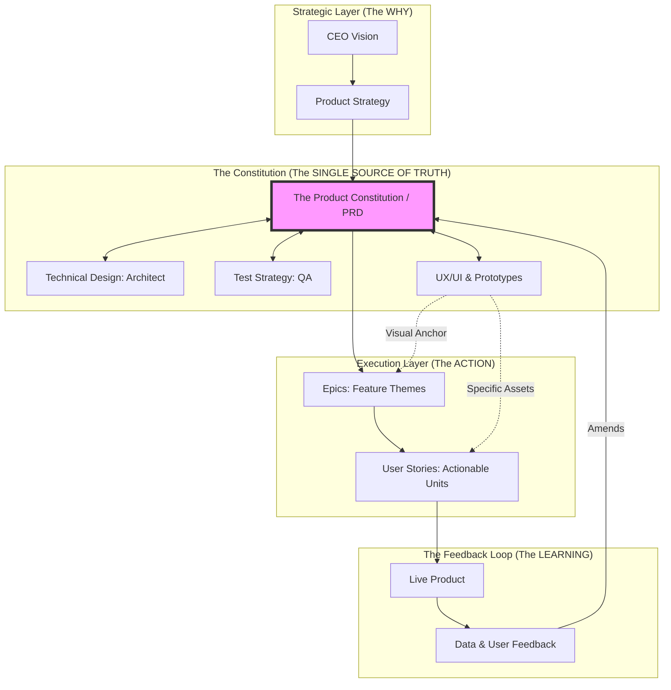

# The Product Information Lifecycle: The Constitutional Flywheel

> **Persona Note:** As someone who has navigated the scaling pains of startups and the bureaucratic mazes of Big Tech (Google, Uber, etc.), I’ve seen that software doesn't fail because of bad code; it fails because of **Information Decay**. This document outlines how to prevent that decay by treating the PRD as the **Product Constitution**—a robust, high-fidelity anchor that ensures the CEO, Architect, and Developer remain in perfect alignment.

## 🗺️ The Information Flywheel (Mermaid)

The following diagram illustrates the recursive nature of high-performance development. The PRD sits at the center as the **Rosetta Stone** for all other artifacts.

---

## 🧠 Deep Dive: The Recursive Loops

In a robust, structured environment, information flows in circles to ensure the "What" is always aligned with the "Possible."

### 1. The Negotiation Loop: TDD & Test Strategy
The PRD is not a static document; it is a **living constitution**.

*   **TDD as a Reality Check:** When the Architect writes the Technical Design Document, they might find that a requirement is technically impossible or too expensive. They push back, and the **PRD is updated** to match reality.
*   **Test Strategy as a Verifiability Check:** If QA cannot find a way to test a requirement, the requirement is "fluff." They push back to ensure every line in the PRD is measurable.
*   **The Result:** You avoid "Information Silos." There is only one source of truth, but it is forged by the friction between Product, Engineering, and QA.

### 2. The Visual Anchor: Connecting UX to the Flow
The **UX/UI Design** acts as the "Universal Translator" between abstract logic and concrete code.

*   **At the PRD Level:** Designs are **Prototypes**. They help stakeholders "feel" the requirements to catch logic gaps early.
*   **At the Epic Level:** Designs are **Maps**. They show the full user journey (the "Happy Path" and the "Sad Path").
*   **At the Story Level:** Designs are **Snippets**. We attach specific Figma frames or assets directly to the User Story so the developer has zero ambiguity about what to build.

### 3. Closing the Loop: The Flywheel Effect
Development shouldn't end when the code is shipped. That is only the halfway point of the flywheel.

1.  **Code to Telemetry:** Once the feature is live, we collect data (usage patterns, errors, drop-offs).
2.  **Telemetry to Insight:** We compare the data against the "Success Metrics" defined in the original PRD.
3.  **Insight to PRD vNext:** The lessons learned from the live product become the starting requirements for the next iteration. 

**This is how you build a robust product:** You don't aim for a "Perfect First Release"; you aim for a **High-Velocity Flywheel** that gets smarter every time it spins.

---

## 🚀 The Decomposition Logic

1.  **Themes:** High-level goals (e.g., "Improve Retention").
2.  **Epics:** Large chunks of work (e.g., "New Onboarding Flow").
3.  **Stories:** Independent value units (e.g., "As a user, I want to verify my email via OTP").
4.  **Tasks:** Implementation details (e.g., "Setup SendGrid API").

**Veteran's Advice:** If your "Stories" aren't mapped back to a "Design Snippet" and a "PRD Requirement," you are building in the dark. Always maintain the thread of traceability.
