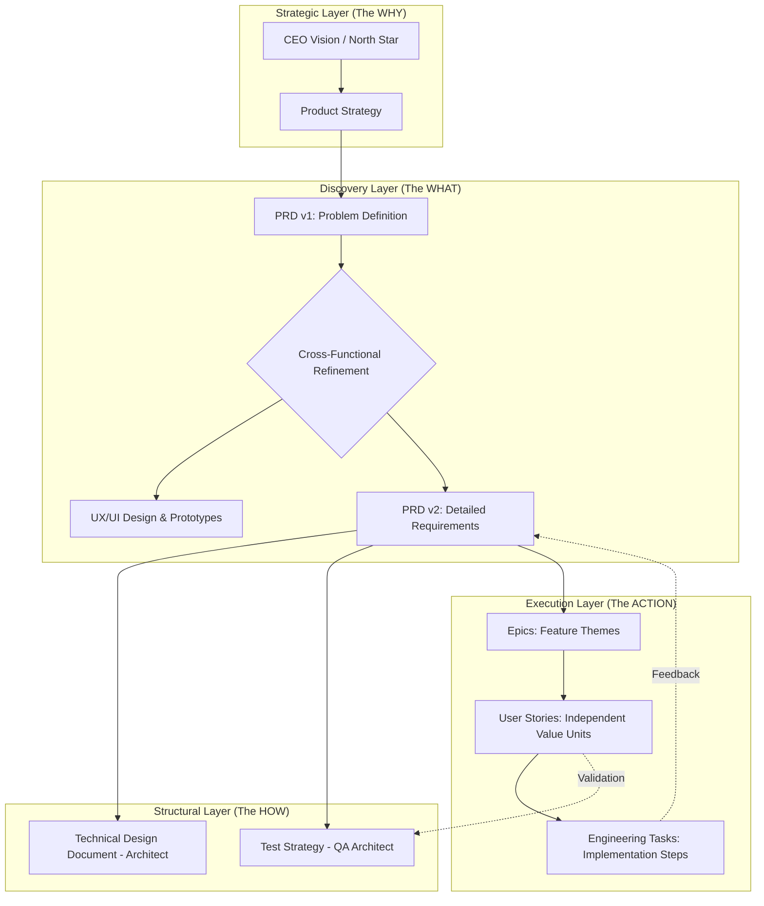

# The Product Information Lifecycle: From Vision to Execution

> **Persona Note:** As someone who has navigated the scaling pains of startups and the bureaucratic mazes of Big Tech (Google, Uber, etc.), I’ve seen that software doesn't fail because of bad code; it fails because of **Information Decay**. This document outlines how to prevent that decay as a vision moves from the CEO's head into a developer's backlog.

## 🗺️ The Information Flow Chart

The following diagram illustrates how "High-Level Intent" is distilled into "Low-Level Action."

---

## 🧠 Deep Dive: Your Questions Answered

### 1. Who are the contributors to the PRD, and does it grow incrementally?

In the "old world" (Waterfall), a PM wrote a PRD in a vacuum and threw it over the wall. In high-performing modern teams, the PRD is a **living organism**.

*   **The Contributors:**
    *   **The PM (The Editor-in-Chief):** Owns the "What" and "Why." They ensure the document solves a real user problem.
    *   **UX/Product Design:** They contribute the "How it feels." Often, the PRD and the Design prototypes evolve together. If a design change happens, the PRD must reflect it.
    *   **Engineering Architect:** They act as the "Reality Check." They contribute technical constraints (e.g., "We can't do this in real-time due to latency").
    *   **QA/Testing Architect:** They are the "Pessimists." They contribute edge cases (e.g., "What happens if the user loses internet mid-transaction?").
*   **Incremental Growth:**
    *   **Phase 1: The One-Pager.** Focuses on the problem, the target audience, and the success metrics.
    *   **Phase 2: The Functional Draft.** Adds user journeys and "Happy Path" requirements.
    *   **Phase 3: The Detailed PRD.** Includes edge cases, analytics tracking, and technical constraints.
    *   **The Transition:** Once the PRD is "stable" (not necessarily "finished"), it is **decomposed**. You don't wait for a 50-page doc. You slice off the first "Epic" and start refining it into stories while the PM continues detailing the next phase.

### 2. Does every role have their own PRD, or is it a Single Source of Truth?

**The Rule: One PRD to Rule Them All.**

If the PM has a PRD, the Architect has their own "Architectural PRD," and the Tester has a "Testing PRD," you have created **Silos**. Information will inevitably diverge, and you will build the wrong thing.

Instead of separate PRDs, we use **Derivative Documents**:

*   **The PRD (The "What"):** This is the source of truth for *behavior*. If anyone wants to know what the product *does*, they look here.
*   **The TDD - Technical Design Document (The "How"):** Written by the Architect. It references the PRD but focuses on database schemas, API contracts, and infrastructure. It doesn't redefine requirements; it explains how to *meet* them.
*   **The Test Plan (The "Verification"):** Written by QA. It maps back to the PRD requirements to ensure every feature is testable.

**Why this matters:** When a requirement changes (e.g., "We now need to support Apple Pay"), you change it in **one place** (the PRD). The Architect then updates the TDD, and QA updates the Test Plan. This is called **Traceability**.

---

## 🚀 The Decomposition Logic

How do we go from a PRD to a Story?

1.  **Themes (The Goal):** "Improve Checkout Conversion."
2.  **Epics (The Big Piece):** "Implement Guest Checkout." (Too big for one sprint).
3.  **Stories (The Value):** "As a guest, I want to enter my email so I can receive a receipt without creating an account." (Small, testable, deliverable).

**Veteran's Advice:** If a story takes more than half a sprint to complete, it's not a story; it's still an Epic. Keep slicing until the "Information Flow" is granular enough to be built without confusion.
