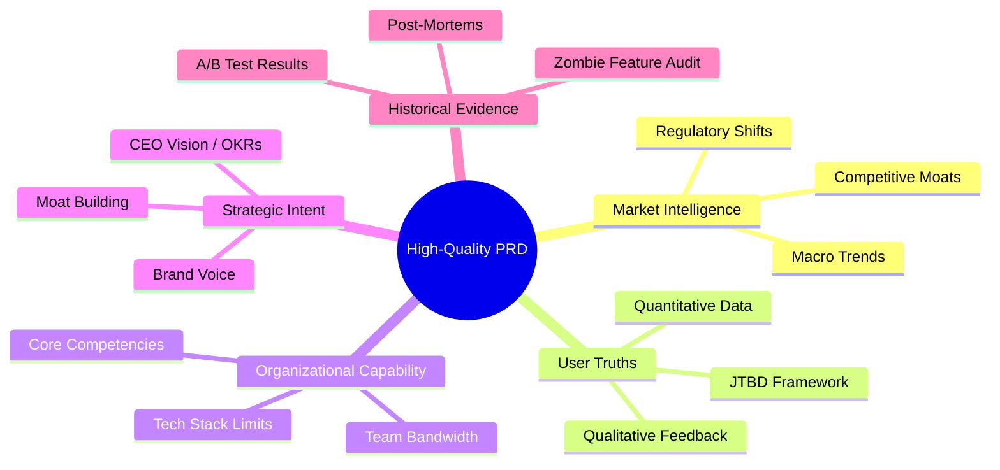
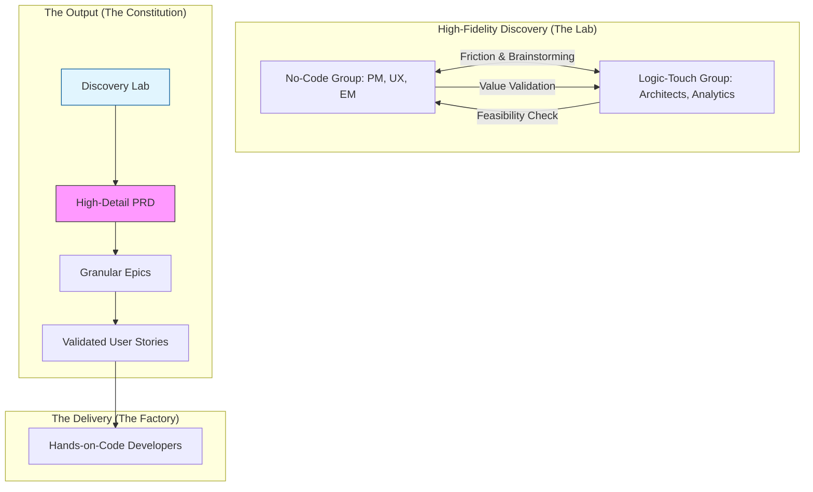
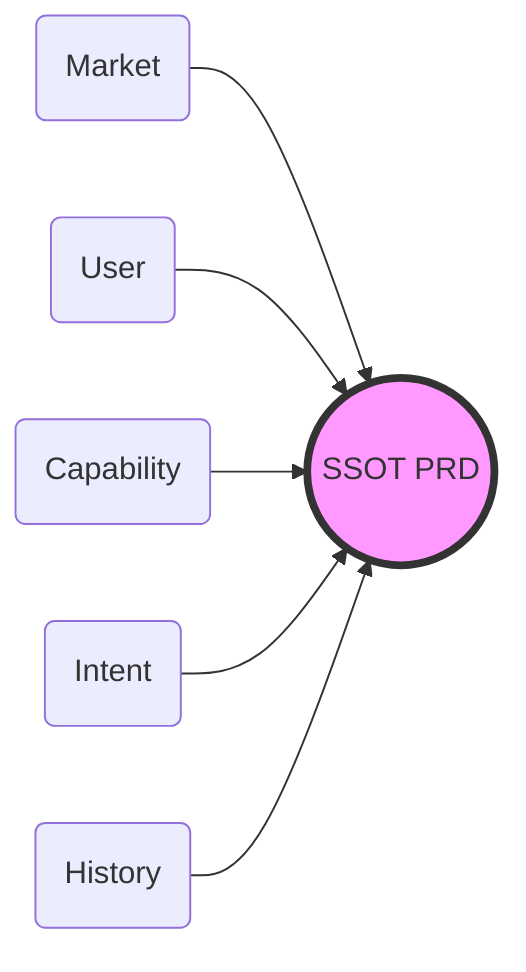

# Strategic Inputs: The Raw Materials of a High-Quality PRD

> **Veteran's Insight:** A PRD is only as good as the information that feeds it. If you feed it assumptions, you build a "Guess." If you feed it data and evidence, you build a "Solution." In the industry, we call this the **GIGO Principle** (Garbage In, Garbage Out). To produce a "Single Source of Truth," you must first synthesize multiple "Streams of Truth."

To build a world-class Product Strategy and a robust PRD, you need to aggregate information across five distinct categories.

---

## 🗺️ Visualizing the Inputs: The Five Streams of Truth

---

## 🌍 1. Market Intelligence (The Terrain)
*External information about the world outside your company.*

*   **Competitive Landscape:** Not just "who" they are, but their "Feature Velocity" and "Strategic Moat." What are they building next?
*   **Macro Trends:** Technological shifts (e.g., Generative AI), economic conditions, and regulatory changes (e.g., GDPR/DMA).
*   **Market Gaps:** Where are users "hacking" existing solutions because no dedicated product exists?

## 👥 2. User Empathy & Evidence (The North Star)
*External information about the human being using the product.*

*   **Quantitative Data (The "What"):** Telemetry, drop-off rates, and usage heatmaps from current products.
*   **Qualitative Feedback (The "Why"):** Interview transcripts, support tickets, and sales call recordings. 
*   **Personas & Jobs-to-be-Done (JTBD):** What is the specific *struggle* the user is trying to solve? (e.g., "I'm not buying a drill; I'm buying a hole in the wall.")

## 🛠️ 3. Organizational Capability (The Engine)
*Internal information about what your company is actually capable of building.*

*   **Technical Constraints:** Existing tech stack, technical debt, and infrastructure limits.
*   **Resource Bandwidth:** The "True Capacity" of the engineering and design teams.
*   **Core Competencies:** What is the one thing your team does better than anyone else? (e.g., "We are great at real-time data but bad at mobile UI.")

## 🎯 4. Strategic Intent (The Fuel)
*Internal information about where the company wants to go.*

*   **Company OKRs:** How does this specific product move the needle for the CEO's quarterly goals?
*   **Moat Strategy:** Does this feature help us "lock in" users or increase the cost for competitors to enter our space?
*   **Brand Positioning:** Does the proposed solution fit the "Voice" and "Promise" of the company?

## 📈 5. Historical Performance (The Rear-View Mirror)
*Information about your past failures and successes.*

*   **Post-Mortems:** What went wrong in the last launch? Was it a tech failure or a "Market-Product Fit" failure?
*   **A/B Test Archives:** Results from past experiments. Why did Version B fail? 
*   **Feature ROI:** Which features are being maintained but have near-zero usage? (The "Zombie Features").

## 🧪 Method: High-Fidelity Discovery Track

To turn these raw inputs into a "Product Constitution," we utilize a **High-Fidelity Discovery Track**. This is a dedicated phase where the logic is simulated and de-risked before a single line of code is written by the "Hands-on-Code" developers.

### The Collaborative Brainstorming Model

High-quality information is produced through the friction between two distinct groups:

#### 1. The "No-Code" Group (The Strategic Intent)
*   **Personas:** Product Manager (PM), UX Designer, Engineering Manager (EM).
*   **Focus:** Desirability, User Flow, Business Value, and Team Velocity.
*   **Goal:** Ensure we are building the *right* thing for the *right* people.

#### 2. The "Logic-Touch" Group (The System Integrity)
*   **Personas:** Software Architects, Solution Architects, Cloud Architects, Analytics Engineers.
*   **Focus:** Feasibility, Scalability, Data Integrity, and Measurability.
*   **Goal:** Ensure the product is built on a *solid, scalable, and measurable* foundation.

### 🗺️ The Discovery Workflow

---

## 🧠 The Synthesis: How to build the SSOT

The "Single Source of Truth" is created when the PM sits at the intersection of these five streams. 

| Stream | Role of the PM |
| :--- | :--- |
| **Market** | Filter out the noise and find the "Signal." |
| **User** | Translate "Complaints" into "Requirements." |
| **Capability** | Negotiate with the **Architect** to find the "Possible." |
| **Intent** | Align the feature with the **Vision**. |
| **History** | Ensure the team doesn't repeat the same mistake. |

### The "High-Thinking" Check
Before you start writing the PRD, ask yourself: **"Which of these five categories am I guessing on?"** 

If you have a gap in *User Evidence*, your PRD will be weak. If you have a gap in *Organizational Capability*, your PRD will be a fantasy. A high-quality PRD is a document that has successfully "De-risked" all five categories before a single line of code is written.

---

## 📚 Industry Parallels & Research

This model of separating **Strategic Discovery** (No-Code + Logic-Touch) from **Tactical Delivery** (Hands-on-Code) is supported by several industry frameworks:

1.  **Dual-Track Agile (Marty Cagan):** Research shows that high-performing teams separate "Discovery" (finding the right product) from "Delivery" (building the product right).
2.  **Strategic Three Amigos:** An evolution of the standard PM/Dev/QA model that brings **Cloud/Data Architects** into the discovery phase to prevent "Late-Stage Architectural Failures."
3.  **The Shift-Left Principle:** By moving architectural thinking and analytics design to the "Left" (the brainstorming phase), you significantly reduce the cost of code re-work.

