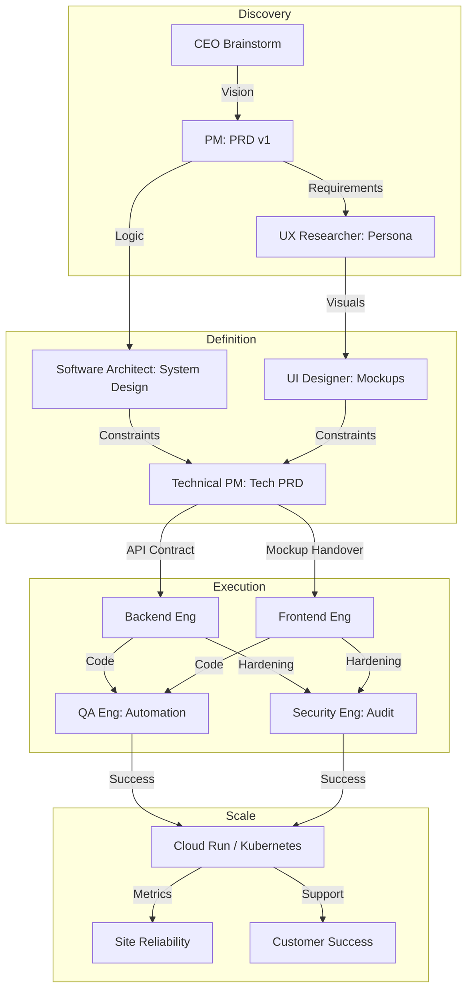

# The Billion-Dollar Blueprint: End-to-End SDLC Mastery
**From Ideation to Enterprise Scale: A Lifecycle Governance Framework**

---

## 1. Executive Preface: The Hierarchy of Engineering Truth
In organizations that scale to billions, the **Software Development Life Cycle (SDLC)** is not a "to-do list"—it is a complex biological system. Failure to coordinate the inputs and outputs between specialized roles leads to "Architectural Rot" and "Market Mismatch." This framework defines the exact handshakes required to move a product from a brain-spark to a globally redundant asset.

---

## 2. The SDLC Phase Matrix: Inputs, Outputs, and Role Orchestration

### Phase 1: Ideation & Discovery (The "Why")
**Objective:** Define the market anomaly and validate that the problem is worth solving.

| Role | Primary Input | Primary Output |
| :--- | :--- | :--- |
| **Product Manager** | Market Signals, CEO Vision | Product Requirement Document (PRD v1) |
| **UX Researcher** | Competitor Benchmarks, User Pain | Behavioral Personas & Problem Validation |
| **Data Scientist** | Raw Market Data, Historical Usage | Feasibility Analysis & Opportunity Sizing |
| **Solutions Architect** | Customer "Pain Points" (B2B) | High-level Integration Proof-of-Concept |

---

### Phase 2: Design & Feasibility (The "How it Feels & Works")
**Objective:** Translate the PRD into an interactive vision and a technical skeleton.

| Role | Primary Input | Primary Output |
| :--- | :--- | :--- |
| **UI/Visual Designer** | PRD, Brand Guidelines | High-Fidelity Mockups / Design System |
| **Interaction Designer** | User Personas, Flows | Clickable Prototype / State Diagrams |
| **Software Architect** | PRD, Technical Constraints | System Architecture Diagram / Tech Stack |
| **Technical PM** | PRD, Architect Specs | Technical PRD / API Contract Drafts |
| **Testing Architect** | PRD, Mockups | Quality Strategy & Automation Plan |

---

### Phase 3: Development & Engineering (The "Build")
**Objective:** Converging the logic, data, and interface into a functional product.

| Role | Primary Input | Primary Output |
| :--- | :--- | :--- |
| **Backend Engineer** | API Contracts, Schema Design | Functional REST/GraphQL APIs, DB Logic |
| **Frontend Engineer** | High-Fidelity Mockups, APIs | Interactive UI Components |
| **Mobile Engineer** | Mockups, Mobile-Specific Specs | Native iOS/Android Build Artifacts |
| **DevOps Engineer** | System Architecture, Tech Stack | CI/CD Pipelines, Deployment Environment |
| **DBA** | Schema Design | Optimized, Scalable Database Engine |

---

### Phase 4: Quality, Security & Risk (The "Shield")
**Objective:** Ensuring the product is reliable, secure, and usable by everyone.

| Role | Primary Input | Primary Output |
| :--- | :--- | :--- |
| **QA Engineer / SDET** | PRD, Test Plan, Codebase | Automated Test Suites / Bug Reports |
| **Security Engineer** | Architecture, Codebase | Vulnerability Audit / Hardened Infrastructure |
| **a11y Specialist** | Frontend Components | WCAG Compliance Report / ARIA Fixes |

---

### Phase 5: Deployment, Growth & Support (The "Release")
**Objective:** Maintaining the product in the wild and ensuring customer value realization.

| Role | Primary Input | Primary Output |
| :--- | :--- | :--- |
| **SRE** | Production Traffic, SLOs | 99.99% Uptime, Auto-scaling Logic |
| **Technical Writer** | PRD, Codebase, APIs | Developer Portal, SDK Guides, Help Docs |
| **Technical Support** | User Reports, Logs | Triage Reports, Bug Escalations |
| **Customer Success** | Product Launch, Customer Goals | User Retention Data, Upsell Signals |
| **Product Ops** | Internal Metrics, Feedback | Process Refinements, Roadmap Inputs |

---

## 3. Product Lifecycle Adaptability (The 3 Development Modes)

Depending on the maturity of the product, the SDLC "intensity" and role-focus must shift. Using the same SDLC for a prototype as you do for a billion-dollar platform is a recipe for bankruptcy.

### Mode A: The Prototype (Validation Phase)
*   **Goal:** Learn if the user cares.
*   **SDLC Style:** **Hyper-Linear / No-Process.**
*   **Role Concentration:** 80% Builders (FE/BE), 20% PM.
*   **Shortcuts:** No automated tests (Testing Architect is idle), generic Cloud setup (Cloud Arch is idle), manual deployment (DevOps is simplified).
*   **Outcome:** A "Vibe" product that proves a point.

### Mode B: The Growth Iteration (Mid-Market Phase)
*   **Goal:** Capture market share and stabilize.
*   **SDLC Style:** **Agile / Continuous Integration.**
*   **Role Concentration:** Balanced. 50% Builders, 20% Scalers, 10% Guardians, 20% Growth.
*   **Evolution:** Automated CI/CD begins. Design Systems are formalized. Analytics Engineering (dbt) becomes critical to understand user churn.
*   **Outcome:** A reliable product with a growing user base.

### Mode C: The Scalable Asset (Enterprise/Billion-Dollar Phase)
*   **Goal:** Zero downtime, global dominance, and regulatory compliance.
*   **SDLC Style:** **Site Reliability Engineering (SRE) / Zero-Trust.**
*   **Role Concentration:** Heavy on Scalers and Guardians (40%). 
*   **Protocol:** "Prophets" (Software Architects) plan 18 months ahead. "Guardians" have veto power over "Builders." Technical Writers ensure the API is a standalone product.
*   **Outcome:** A high-leverage utility that runs itself.

---

## 4. The Unified Information Flow Chart

---

## 5. Summary Recommendations for Leadership
1.  **Don't Hire "Guardians" too early:** If you are building a prototype, a Security Engineer or a Testing Architect will slow you down. Start with "Builders."
2.  **Don't scale without "Scalers":** Once you hit $10M ARR, your Builders will start burning out fixing server issues. That is the signal to hire SREs and DevOps.
3.  **The "Input" Quality Law:** The quality of the code is capped by the quality of the PRD. If the PM doesn't give a clear input, the Backend Engineer's output will be "Garbage-In, Garbage-Out."

---
*Blueprint Generated for ANT-Coding Project | Strategic Engineering Excellence*
